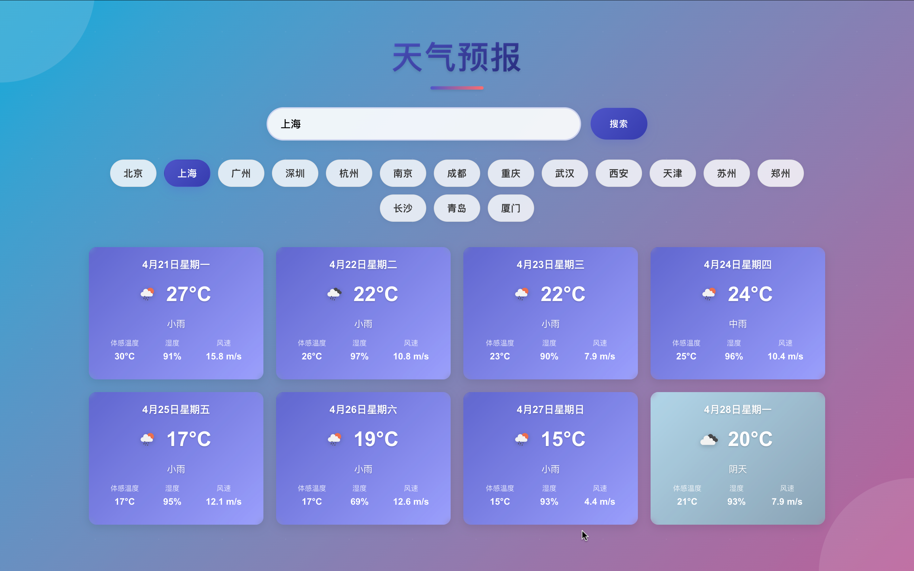
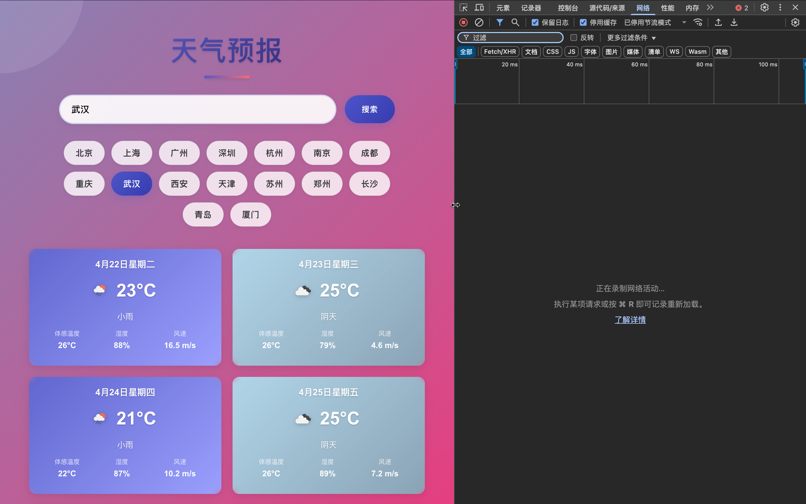

# Weather Forecast App 天气预报应用

A modern weather forecast application built with React, featuring real-time weather data, beautiful UI, and responsive design.

一个使用 React 构建的现代天气预报应用，具有实时天气数据、精美的用户界面和响应式设计。

🌐 **Live Demo 在线演示**: [https://bdma.github.io/weather-react/](https://bdma.github.io/weather-react/)

## Screenshots 项目截图

### 主界面 Main Interface

*展示天气卡片和温度图表的现代界面 Modern interface showing weather cards and temperature chart*


### 加载动画 Loading Animation

*骨架屏加载动画效果 Skeleton loading animation*

### 响应式设计 Responsive Design

*在不同设备上的显示效果 Display on different devices*

## Features 功能特点

- Real-time weather data display 实时天气数据显示
- 8-day weather forecast 8天天气预报
- City search functionality 城市搜索功能
- Quick access to major cities 主要城市快速访问
- Responsive design 响应式设计
- Loading skeleton animation 加载骨架屏动画
- Weather-based themes 基于天气的主题样式

## Tech Stack 技术栈

### Environment 环境要求
- Node.js v20.17.0
- npm (Node Package Manager)

### Frontend 前端
- React (基于 Create React App)
- TypeScript
- SCSS (CSS preprocessor CSS 预处理器)
- Recharts (图表库)

### APIs APIs 接口
- OpenWeather API (天气数据接口)

### Key Dependencies 主要依赖
```json
{
  "react": "^18.2.0",
  "typescript": "^4.9.5",
  "sass": "^1.62.0",
  "recharts": "^2.5.0",
  "axios": "^1.3.5"
}
```

## Project Structure 项目结构

```
weather-app/
├── src/
│   ├── components/          # React components React 组件
│   ├── services/           # API services API 服务
│   ├── styles/             # SCSS styles SCSS 样式
│   ├── types/             # TypeScript types TypeScript 类型
│   └── utils/             # Utility functions 工具函数
├── public/                # Static files 静态文件
└── package.json          # Project dependencies 项目依赖
```

## Key Components 主要组件

### WeatherForecast 天气预报组件
- Main component for weather display 主要的天气显示组件
- Handles data fetching and display 处理数据获取和显示
- Implements skeleton loading 实现骨架屏加载
- Manages city selection 管理城市选择

### Features Implementation 功能实现

#### Skeleton Loading 骨架屏加载
- Uses CSS animations for loading state 使用 CSS 动画实现加载状态
- Provides smooth transition 提供平滑过渡效果
- Enhances user experience 增强用户体验

#### Weather Themes 天气主题
- Dynamic background gradients 动态背景渐变
- Weather-based color schemes 基于天气的配色方案
- Smooth transitions 平滑过渡效果

#### Temperature Chart 温度图表
- Interactive line chart 交互式折线图
- 5-day temperature trend 五天温度趋势
- Responsive design 响应式设计

## Getting Started 快速开始

1. Clone the repository 克隆仓库
```bash
git clone <repository-url>
```

2. Install dependencies 安装依赖
```bash
npm install
```

3. Set up environment variables 设置环境变量
```bash
REACT_APP_WEATHER_API_KEY=your_api_key
```

4. Start the development server 启动开发服务器
```bash
npm start
```

## API Configuration API 配置

The app uses the OpenWeather API. You'll need to:
应用使用 OpenWeather API，你需要：

1. Sign up at OpenWeather 在 OpenWeather 注册
2. Get an API key 获取 API 密钥
3. Add it to your .env file 将其添加到 .env 文件中

## Styling 样式设计

The app uses SCSS with:
应用使用 SCSS，包含：

- Modern gradient designs 现代渐变设计
- Glass morphism effects 玻璃态效果
- Responsive layouts 响应式布局
- Dynamic weather themes 动态天气主题
- Smooth animations 平滑动画效果

## Contributing 贡献指南

1. Fork the repository Fork 仓库
2. Create your feature branch 创建特性分支
3. Commit your changes 提交更改
4. Push to the branch 推送到分支
5. Create a Pull Request 创建拉取请求

## License 许可证

This project is licensed under the MIT License.
本项目采用 MIT 许可证。
